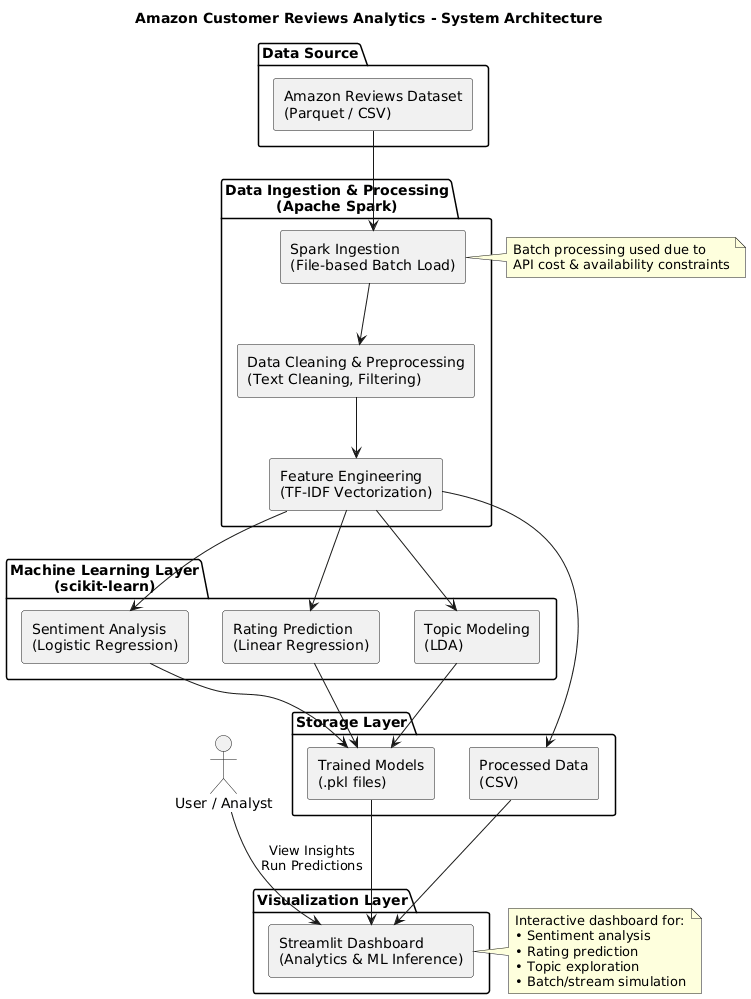

# System Architecture and Data Pipeline

## 🏗️ High-Level System Architecture
The project follows a **layered and modular architecture**, ensuring scalability, clarity, and separation of concerns.

### Architecture Layers
1. Data Source Layer
2. Ingestion & Processing Layer
3. Machine Learning Layer
4. Storage Layer
5. Visualization Layer

## 🧱 Architecture Diagram

> The diagram illustrates the flow from raw review data ingestion through Spark-based processing, machine learning models, and final visualization.

## 🔄 Data Flow Description

| Stage | Technology | Description |
|-----|------------|-------------|
| Data Source | Parquet Files | Amazon review dataset |
| Processing | Apache Spark | Cleaning & transformation |
| Feature Engineering | TF-IDF | Text vectorization |
| ML Models | Scikit-learn | Sentiment, Rating, Topics |
| Storage | CSV / PKL | Processed data & models |
| Visualization | Streamlit | Interactive dashboard |

## 📥 Data Ingestion Strategy
Due to the absence of free real-time Amazon review APIs and high costs of cloud streaming services, **batch ingestion** was adopted.

Additionally, **file-based streaming simulation** was implemented to demonstrate near-real-time behavior using incremental batch files.

This design choice was **approved by the instructor** and aligns with practical constraints.

## ⚙️ Why Apache Spark?
Apache Spark enables:
- Distributed data processing
- Efficient handling of large datasets
- Scalable transformations and filtering

It forms the backbone of the analytics pipeline.
