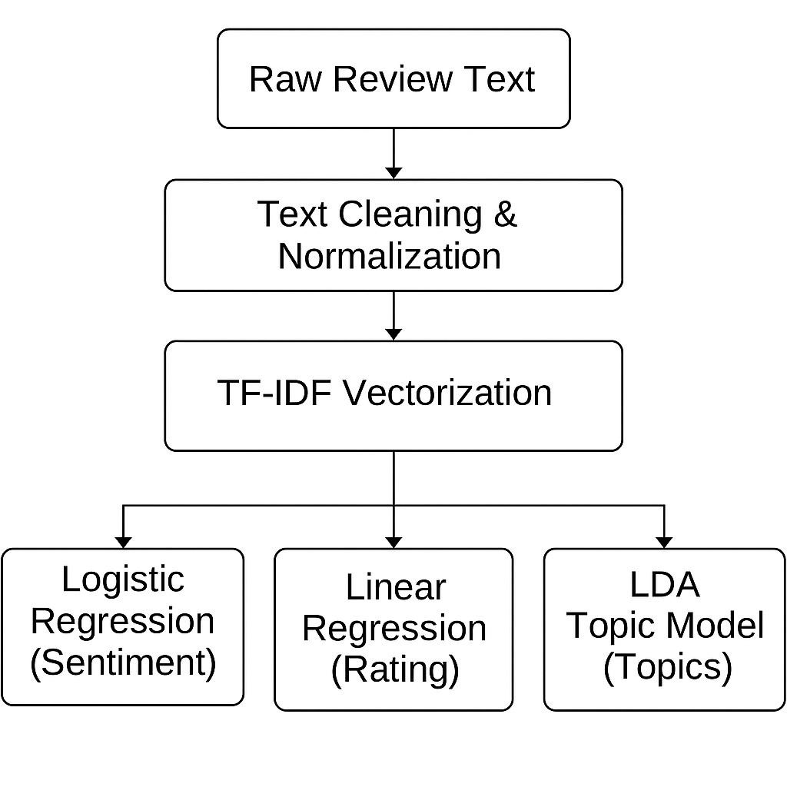

# Data Processing and Machine Learning

## 🧹 Data Cleaning and Preprocessing
The raw dataset undergoes multiple preprocessing steps:

| Step | Description |
|----|-------------|
| Missing Value Removal | Drop incomplete records |
| Text Normalization | Lowercasing, punctuation removal |
| Deduplication | Remove duplicate reviews |
| Sampling | Improve training efficiency |

These steps ensure data quality and consistency.

## 🔤 Feature Engineering
Text data is converted into numerical features using **TF-IDF vectorization**, which captures word importance while reducing noise.

📷 **Suggested Image: Feature Engineering and Machine Learning Pipeline**

The diagram below illustrates how raw customer review text is transformed into numerical features using TF-IDF vectorization and then consumed by multiple machine learning models for different analytical tasks.

**Figure Description:**  
Raw customer review text is first cleaned and normalized. The processed text is then converted into numerical representations using TF-IDF vectorization. These TF-IDF features are shared across multiple machine learning models, including Logistic Regression for sentiment classification, Linear Regression for rating prediction, and Latent Dirichlet Allocation (LDA) for topic modeling.

## 🤖 Machine Learning Models

### Sentiment Classification
| Aspect | Details |
|-----|--------|
| Model | Logistic Regression |
| Input | TF-IDF vectors |
| Output | Positive / Neutral / Negative |
| Goal | Measure customer satisfaction |

### Rating Prediction
| Aspect | Details |
|-----|--------|
| Model | Linear Regression |
| Input | TF-IDF features |
| Output | Predicted star rating |
| Goal | Estimate rating from text |

### Topic Modeling
| Aspect | Details |
|-----|--------|
| Model | Latent Dirichlet Allocation (LDA) |
| Output | Hidden topics |
| Goal | Identify recurring themes |

## 💾 Model Persistence
All trained models and vectorizers are serialized as `.pkl` files and reused in the Streamlit dashboard for real-time inference.
